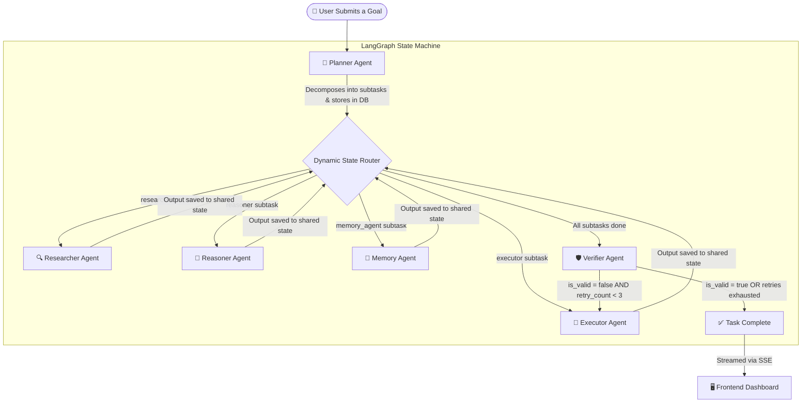

# AgentForge 🌌

[](https://github.com/langchain-ai/langgraph)
[](https://fastapi.tiangolo.com)
[](https://nextjs.org)
[](https://aistudio.google.com)
[](https://neon.tech)
[](https://www.docker.com)
[](https://render.com)

> *"A self-healing, semantically-aware AI workforce that researches, reasons, plans, executes, verifies, and continuously improves complex real-world tasks."*

---

## 🌟 What is AgentForge?

AgentForge is a **Multi-Agent Workforce Platform** — not a chatbot, not a single-model assistant, but a coordinated team of specialized AI workers that collaborate on complex, multi-step goals.

Most AI tools today operate like a single freelancer handed an entire project. They attempt to plan, research, write, and verify all at once — leading to inconsistent quality, hallucinations, and poor performance on long-horizon tasks.

AgentForge solves this by thinking like an **organization**. Work is distributed across dedicated agents — each with a defined role, its own reasoning loop, and a handoff protocol. The result is a pipeline that is more accurate, more transparent, and more reliable than any single-model approach.

---

## ✨ What's New

| Feature | Status | Description |
| :--- | :---: | :--- |
| 🔁 **Self-Healing Verification Loops** | ✅ Shipped | If the Verifier rejects the Executor's output, the pipeline automatically routes back to the Executor with the verifier's feedback as a correction prompt. Retries up to 3 times before finalizing. |
| 🧠 **Semantic Vector Memory** | ✅ Shipped | The Memory Agent now generates 3072-dimensional embeddings via `gemini-embedding-001` and retrieves past insights using pure-Python cosine similarity. Backward compatible with legacy keyword-matched entries. |
| 🛡️ **Production-Safe Retry Logic** | ✅ Shipped | Rate-limit (429) handling with exponential backoff parsed from API response headers, across all six agents. |
| 🔌 **MCP Plugin Bus** | ✅ Shipped | Extensible Model Context Protocol manager for registering stdio-compatible external tool servers. |

---

## 👥 The Six Agent Roles

| Icon | Agent | Role | What It Does |
| :---: | :--- | :--- | :--- |
| 🧭 | **Planner** | Project Manager | Reads the user's goal and decomposes it into 2–3 ordered subtasks. Decides which agent handles which step. |
| 🔍 | **Researcher** | Intelligence Analyst | Searches the web via Tavily, aggregates sources, and produces a structured research document. |
| 🧠 | **Reasoner** | Critical Thinker | Receives research output, cross-checks facts, identifies logical gaps, runs SWOT-style analysis, and draws conclusions. |
| 📝 | **Executor** | Technical Writer / Developer | Takes research and reasoning as context and produces the final deliverable — a report, code, guide, or analysis. Accepts correction feedback from the Verifier on retry loops. |
| 🛡️ | **Verifier** | QA Inspector | Fact-checks the Executor's output against the original goal, scores confidence (0.0–1.0), flags hallucinations, and triggers self-healing loops on failure. |
| 📁 | **Memory** | Institutional Librarian | Generates semantic embeddings of past task insights. Retrieves the most contextually relevant memories via cosine similarity before new tasks begin. |

---

## 🔄 How the Agents Collaborate — The Full Flow



### Step-by-Step Walkthrough

**Step 1 — Planning**
The user submits a goal. The Planner Agent reads the full goal and uses the language model to intelligently decompose it into 2–3 sequential subtasks. Each subtask is assigned to the appropriate specialist agent and stored in the database.

**Step 2 — Memory Recall**
Before execution begins, the Memory Agent performs a semantic similarity search across past task insights using `gemini-embedding-001` embeddings, surfacing the most contextually relevant historical knowledge.

**Step 3 — Dynamic Routing**
The LangGraph orchestrator reads the ordered subtask list. A conditional routing function inspects each subtask's `assigned_agent` field and dispatches it to the correct node in the graph — no hard-coded sequence, fully data-driven.

**Step 4 — Sequential Agent Execution**
Each agent runs one subtask at a time. It receives the full context from all previous agents, performs its specialized reasoning, and appends its output to the shared `AgentState` dictionary before returning control to the router. Real-time thinking logs are written to the database and streamed live to the frontend.

**Step 5 — Verification & Self-Healing**
Once all subtasks are complete, the Verifier Agent runs automatically. It evaluates the Executor's final output against the original goal and assigns a confidence score.
- If `is_valid = true` → the task completes and the result is saved.
- If `is_valid = false` AND `retry_count < 3` → the verifier's feedback is injected into the Executor's prompt and the pipeline self-corrects. The retry counter increments with each loop.
- If retries are exhausted → the best available result is saved with a `failed` status.

**Step 6 — Memory Storage**
After verification, the Memory Agent saves the key lesson from the completed task as a semantic vector. Future tasks on similar topics will retrieve this context, making the system progressively smarter over time.

---

## 🛠️ Architecture & Technology

AgentForge is composed of three layers — a stateful backend workflow engine, a REST API communication layer, and a real-time frontend dashboard.

---

### Layer 1 — Workflow Engine (LangGraph + Python)

The brain of the system. LangGraph compiles a **StateGraph** — a directed flowchart of agent nodes and conditional routing edges. A shared `AgentState` dictionary acts as the project file, passed from node to node and enriched at each step.

```python
# AgentState carries the full context of a running task
class AgentState(TypedDict):
    task_id: str
    prompt: str
    plugin_name: str
    subtasks: List[Dict[str, Any]]
    current_subtask_index: int
    agent_outputs: Dict[str, str]
    verification_results: Dict[str, Any]
    final_result: str
    retry_count: int          # Tracks self-healing loop iterations
    verifier_feedback: str    # Carries correction notes from Verifier → Executor
```

Every agent node follows the same contract:
- Reads from the shared state
- Calls Gemini 2.5 Flash with a focused, scoped prompt
- Writes its output back to the shared state
- Updates the task and subtask status in the database

The graph is compiled once at application startup and reused for every task, making execution stateless and concurrent-safe.

---

### Layer 2 — API Server (FastAPI + Async Python)

FastAPI serves as the coordination layer between the frontend and the workflow engine. When a user submits a task, FastAPI:

1. Creates a `Task` record in the database
2. Launches the LangGraph workflow as a **background task** (non-blocking)
3. Returns the task ID to the frontend immediately

The frontend then opens a **Server-Sent Events (SSE)** stream on that task ID. The SSE endpoint polls the database every 500ms and pushes any new agent logs, subtask status changes, or final results to the frontend in real time.

---

### Layer 3 — Frontend Dashboard (Next.js + TypeScript)

The visual command center of the application. Built with Next.js App Router and rendered as a dark glassmorphism interface. The dashboard features:

- **Workflow Graph** — A live SVG node graph showing which agent is active and how data flows between them
- **Agent Terminal** — A monospace console streaming raw thinking logs from each agent in real time, including self-healing loop notifications
- **Execution Timeline** — A step-by-step checklist of subtask statuses (pending → running → completed)
- **Verified Output Viewer** — A clean Markdown document renderer showing the final polished result with confidence scoring

---

### Supporting Systems

**PostgreSQL (Neon) / SQLite**
Stores all tasks, subtasks, agent logs, memory entries, and MCP server configurations. On Render (production), a Neon PostgreSQL instance is used. Locally, SQLite is the default for zero-configuration setup. Memory vectors are persisted as JSON-serialized float arrays in the `embedding_searchable_text` text column — no schema migration required.

**Semantic Vector Memory**
The Memory Agent uses `models/gemini-embedding-001` to generate 3072-dimensional vector embeddings for every stored memory. Retrieval computes cosine similarity using pure Python (no numpy required), with a calibrated `0.60` threshold to filter low-confidence matches. Legacy entries without embeddings fall back gracefully to keyword matching.

**Model Context Protocol (MCP) Manager**
An extensible plugin bus for external tools. The MCP manager connects to any stdio-compatible server (Node.js, Python, or any CLI tool), discovers its available tools via JSON-RPC, and makes those tools callable by any agent — without modifying agent code.

**Tavily Search API**
Used exclusively by the Researcher Agent. Tavily is a search API purpose-built for AI agents — it returns structured, summarized results (not raw HTML) optimized for language model consumption.

**Gemini 2.5 Flash**
The language model powering all six agents. Chosen for its large context window (critical for processing multi-agent accumulated state), fast inference speed, and structured JSON output mode (used by the Planner and Verifier for reliable schema-validated responses). All API calls include automatic retry logic with delay parsed from rate-limit headers.

---

## 📂 Folder Structure

```
agentforge/
│
├── backend/                    # Python backend — FastAPI, LangGraph, Agents
│   ├── app/
│   │   ├── api/                # REST endpoints (tasks, agents, memory, plugins, mcp)
│   │   ├── agents/             # Six agent definitions (planner, researcher, reasoner, executor, verifier, memory)
│   │   │   ├── base.py         # BaseAgent: LLM execution, DB logging, rate-limit retry
│   │   │   ├── planner.py
│   │   │   ├── researcher.py
│   │   │   ├── reasoner.py
│   │   │   ├── executor.py     # Accepts verifier feedback for self-healing corrections
│   │   │   ├── verifier.py
│   │   │   └── memory_agent.py # Semantic embedding + cosine similarity retrieval
│   │   ├── core/               # Environment config loader
│   │   ├── database/           # SQLAlchemy models and session management
│   │   ├── mcp/                # MCP JSON-RPC client and manager
│   │   ├── plugins/            # Workflow plugin registry and built-in plugins
│   │   ├── workflows/
│   │   │   ├── state.py        # AgentState TypedDict (incl. retry_count, verifier_feedback)
│   │   │   └── orchestrator.py # LangGraph graph with self-healing conditional edges
│   │   └── main.py             # FastAPI application entrypoint
│   └── test_system.py          # Integration verification script
│
├── frontend/                   # Next.js frontend — Dashboard UI
│   └── src/
│       ├── app/                # App Router pages (chat, memory, plugins, mcp, recent)
│       ├── components/         # UI components (WorkflowGraph, AgentTerminal, Timeline, etc.)
│       └── lib/                # API client helpers
│
├── docker-compose.yml          # Local container orchestration
├── render.yaml                 # Render PaaS deployment configuration
└── .env.example                # Environment variable template
```

---

## 🔌 Plugin System

AgentForge's workflow sequences are not hard-coded. Each workflow is packaged as a **Plugin** — a self-contained configuration class that defines:

- The **name and ID** of the workflow (displayed in the UI dropdown)
- A **description** of what it does
- Custom **system instructions** for each agent (overriding their default personas)
- A **default subtask sequence** if the Planner should bypass LLM decomposition

Two plugins ship out of the box:

| Plugin | Purpose | Agent Sequence |
| :--- | :--- | :--- |
| **Startup Market Research** | Market sizing, SWOT analysis, competitor profiling | Memory → Researcher → Reasoner → Executor → Verifier |
| **Software Debugging Suite** | Root cause diagnosis and code fix generation | Researcher → Reasoner → Executor → Verifier |

New plugins can be added by creating a single class file and registering it in the plugin registry. The frontend immediately reflects the new workflow option with no UI changes required.

---

## 🚀 Getting Started

### Prerequisites

- Python 3.10+
- Node.js 18+
- A [Gemini API key](https://aistudio.google.com) (free tier works)
- A [Tavily API key](https://tavily.com) (for live web search)

### Local Setup

```bash
# 1. Clone the repository
git clone https://github.com/ultronop592/Agent-Forge.git
cd Agent-Forge

# 2. Set up environment variables
cp .env.example .env
# Fill in GEMINI_API_KEY and TAVILY_API_KEY in .env

# 3. Install backend dependencies
pip install -r backend/requirements.txt

# 4. Start the backend
python -m backend.app.main

# 5. Install and start the frontend
cd frontend
npm install
npm run dev
```

The dashboard will be available at `http://localhost:3000`.

### Docker (Recommended)

```bash
docker-compose up --build
```

---

## 🔮 Future Roadmap

**Memory TTL & Expiration**
Add an `expires_at` timestamp column to the `Memory` model. Expired memories are automatically filtered out during retrieval and cleaned up by a daily background task — preventing context pollution from stale insights.

**Containerized MCP Sandboxing**
Run all external MCP tool servers inside isolated Docker containers, preventing third-party scripts from accessing the host filesystem or network during production execution.

**Full-Duplex WebSocket Streaming**
Upgrade the current one-way Server-Sent Events stream to bidirectional WebSockets, enabling users to inject instructions or corrections into an active pipeline mid-execution.

**Multi-User Authentication**
Add OAuth 2.0 authentication and per-user task isolation to support concurrent multi-tenant usage on a shared deployment.

**pgvector Integration**
As the memory bank scales beyond thousands of entries, replace the in-Python cosine similarity scan with PostgreSQL's native `pgvector` extension for indexed, sub-millisecond similarity queries.

---

## 📄 License

MIT License. See [LICENSE](LICENSE) for details.
