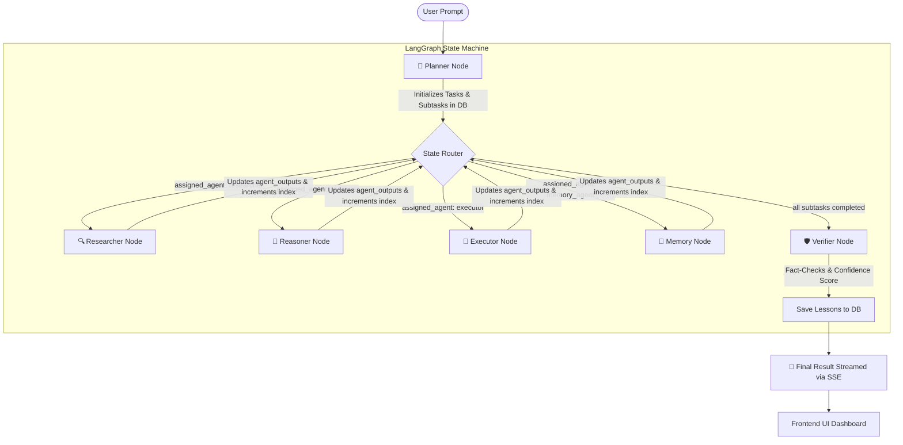

# AgentForge 🌌

[](https://github.com/langchain-ai/langgraph)
[](https://fastapi.tiangolo.com)
[](https://nextjs.org)
[](https://aistudio.google.com)
[](https://sqlite.org)
[](https://www.docker.com)

> **Tagline:** *“A collaborative AI workforce that researches, reasons, plans, executes, verifies, and continuously improves complex real-world tasks.”*

---

## 🌟 What is AgentForge?

AgentForge is a **Multi-Agent Workforce Platform** designed to solve complex, multi-step tasks by coordinating specialized AI agents. Unlike standard single-prompt chatbots that struggle with long-context planning, hallucinations, and critical self-correction, AgentForge operates like an **autonomous software organization in a box**.

The platform splits the cognitive load among **six specialized agents**. They execute work sequentially, pass structured data through a shared state, store long-term learnings, and perform QA verification before presenting the final result.

---

## 👥 Meet the AI Workforce

Each agent is defined in the backend and runs inside a dedicated LangGraph node with its own system instructions, tools, and execution loops:

| Icon | Agent Name | Source File | Corporate Role | Primary Responsibilities |
| :---: | :--- | :--- | :--- | :--- |
| 🧭 | **Planner** | [`planner.py`](file:///c:/kaggle%20ai%20agent/backend/app/agents/planner.py) | *Project Manager / Architect* | Reads the user prompt, breaks it down into structured subtasks, and assigns nodes. |
| 🔍 | **Researcher** | [`researcher.py`](file:///c:/kaggle%20ai%20agent/backend/app/agents/researcher.py) | *Market & Technical Analyst* | Gathers information using Tavily search queries, crawls targets, and compiles raw text references. |
| 🧠 | **Reasoner** | [`reasoner.py`](file:///c:/kaggle%20ai%20agent/backend/app/agents/reasoner.py) | *Critical Thinker / Critic* | Analyzes search findings, detects logical discrepancies, runs SWOT checks, and formats notes. |
| 📝 | **Executor** | [`executor.py`](file:///c:/kaggle%20ai%20agent/backend/app/agents/executor.py) | *Developer & Technical Writer* | Synthesizes researched data and reasoning guidelines into final markdown reports or code blocks. |
| 🛡️ | **Verifier** | [`verifier.py`](file:///c:/kaggle%20ai%20agent/backend/app/agents/verifier.py) | *Quality Assurance (QA) Inspector* | Fact-checks generated output against initial constraints, flags hallucinations, and scores confidence. |
| 📁 | **Memory** | [`memory_agent.py`](file:///c:/kaggle%20ai%20agent/backend/app/agents/memory_agent.py) | *Librarian / Historian* | Queries historical task results for relevant past insights, and saves new learnings to the database. |

---

## 🔄 How the Workforce Collaborates (Under the Hood)

When a user submits a goal (e.g., *"Research competitive pricing structures in AI platform tools"*), the backend routes the task through a LangGraph state machine:



### Process Lifecycle:
1. **Plan & Decompose**: The **Planner** receives the request and dynamically decomposes it into an ordered list of subtasks.
2. **Sequential Routing**: The [`orchestrator.py`](file:///c:/kaggle%20ai%20agent/backend/app/workflows/orchestrator.py) script reads the subtask list and sequentially invokes the correct agent node.
3. **Execution & Update**: Each agent posts live logs to SQLite, updates the backend state dict, and yields execution to the next node.
4. **Factual Verification**: The **Verifier** runs a final pass. If validation is successful, the output is saved to the dashboard, and key insights are recorded for future workflows.

---

## 🛠️ The Tech Stack

AgentForge uses modern, production-grade frameworks designed for performance and flexibility:

### 1. LangGraph State Machine
Powering the core backend workflow is [LangGraph](https://github.com/langchain-ai/langgraph). It maintains the `AgentState` object, which passes the task description, subtask details, agent outputs, and verifications safely between nodes. Check out [`state.py`](file:///c:/kaggle%20ai%20agent/backend/app/workflows/state.py) for the schema design.

### 2. FastAPI Async Server
The API backend ([`main.py`](file:///c:/kaggle%20ai%20agent/backend/app/main.py)) leverages async Python for background task processing. It uses **Server-Sent Events (SSE)** via [`tasks.py`](file:///c:/kaggle%20ai%20agent/backend/app/api/tasks.py) to stream real-time thinking logs from active agent subprocesses directly to the UI without the overhead of WebSockets.

### 3. Next.js App Router (Frontend)
The interface is a visual command center written in Next.js and Tailwind CSS featuring:
* **Workflow Graph**: An interactive, dynamic SVG representation of the active agent workflow showing which node is running.
* **Agent Terminal**: Monospace panel streaming raw agent logs in real time.
* **Timeline Tracker**: An execution list indicating task statuses (`pending`, `running`, `completed`).

### 4. Model Context Protocol (MCP) Manager
The system integrates an MCP client ([`client.py`](file:///c:/kaggle%20ai%20agent/backend/app/mcp/client.py)) matching Anthropic's open standard. It can spin up local stdio servers (Python scripts, Node apps, or CLI tools), parse their JSON-RPC manifest, and automatically register their functions as tools that agents can invoke.

---

## 📂 Folder Structure Map

Here is the master layout of the workspace. Click any file or directory link to jump directly to its implementation:

```
agentforge/
│
├── 📂 backend/                             # BACKEND ENGINE (FastAPI, LangGraph & SQLite)
│   ├── 📂 app/
│   │   ├── 📂 api/                         # REST API endpoints
│   │   │   ├── 📄 agents.py                # Returns active agent configurations
│   │   │   ├── 📄 mcp.py                   # Registers and manages MCP servers
│   │   │   ├── 📄 memory.py                # Queries SQLite database memories
│   │   │   ├── 📄 plugins.py               # Lists registered workflow templates
│   │   │   └── 📄 tasks.py                 # Handles execution triggers & SSE streams
│   │   │
│   │   ├── 📂 agents/                      # LLM Agent Definitions
│   │   │   ├── 📄 base.py                  # BaseAgent (Gemini SDK helper & retry fallback)
│   │   │   ├── 📄 planner.py               # 🧭 Planner Agent logic
│   │   │   ├── 📄 researcher.py            # 🔍 Research Agent logic
│   │   │   ├── 📄 reasoner.py              # 🧠 Reasoner Agent logic
│   │   │   ├── 📄 executor.py              # 📝 Execution Agent logic
│   │   │   ├── 📄 verifier.py              # 🛡️ Verifier Agent logic
│   │   │   └── 📄 memory_agent.py          # 📁 Memory Agent logic
│   │   │
│   │   ├── 📂 core/                        # System Configurations
│   │   │   └── 📄 config.py                # Loads environment variables from .env
│   │   │
│   │   ├── 📂 database/                    # SQLite Schema & connection configuration
│   │   │   ├── 📄 connection.py            # SQLite session creator
│   │   │   └── 📄 models.py                # SQLAlchemy Models (Task, Subtask, AgentLog)
│   │   │
│   │   ├── 📂 mcp/                         # Model Context Protocol Client
│   │   │   └── 📄 client.py                # JSON-RPC Client interfacing with stdio servers
│   │   │
│   │   ├── 📂 plugins/                     # Task-specific Plugin Workflows
│   │   │   ├── 📄 base_plugin.py           # Base Plugin abstract class
│   │   │   ├── 📄 registry.py              # Plugin registry manager
│   │   │   ├── 📄 software_debug.py        # 🐞 Software Debugging workflow plugin
│   │   │   └── 📄 startup_research.py      # 📈 Startup Market Research workflow plugin
│   │   │
│   │   ├── 📂 workflows/                   # LangGraph Flowchart definition
│   │   │   ├── 📄 state.py                 # Dict-based Shared Graph State definition
│   │   │   └── 📄 orchestrator.py          # LangGraph graph compiles, nodes & edges definitions
│   │   │
│   │   └── 📄 main.py                      # FastAPI App entrypoint
│   │
│   ├── 📄 requirements.txt                 # Python dependencies
│   ├── 📄 test_system.py                   # Automated integration compiler test script
│   └── 📄 Dockerfile                       # Python service Dockerfile
│
├── 📂 frontend/                            # FRONTEND DASHBOARD (Next.js & TypeScript)
│   ├── 📂 src/
│   │   ├── 📂 app/                         # App Router routing directories
│   │   │   ├── 📂 chat/                    # Primary interactive chat Workspace view
│   │   │   ├── 📂 mcp/                     # MCP Console (add servers & trigger tools)
│   │   │   ├── 📂 memory/                  # Database Memory Viewer
│   │   │   ├── 📂 plugins/                 # Installed plugins registry page
│   │   │   ├── 📂 recent/                  # Completed execution history dashboard
│   │   │   ├── 📄 layout.tsx               # Main Dashboard sidebar wrapper
│   │   │   ├── 📄 globals.css              # Custom themes, scrolling & glow styles
│   │   │   └── 📄 page.tsx                 # Entry workspace landing metrics page
│   │   │
│   │   ├── 📂 components/                  # Custom components
│   │   │   ├── 📄 AgentCard.tsx            # Grid card tracking live agent progress status
│   │   │   ├── 📄 AgentTerminal.tsx        # Command terminal viewport showing log history
│   │   │   ├── 📄 MarkdownRenderer.tsx     # Custom MD preview with code formatting
│   │   │   ├── 📄 Sidebar.tsx              # Application layout sidebar navigation
│   │   │   ├── 📄 Timeline.tsx             # Interactive subtask process progress checklist
│   │   │   └── 📄 WorkflowGraph.tsx        # Dynamic SVG flow charting graph nodes transitions
│   │   │
│   │   └── 📂 lib/
│   │       └── 📄 api.ts                   # Central client API helpers
│   │
│   ├── 📄 package.json                     # Frontend NPM dependencies
│   └── 📄 Dockerfile                       # Next.js service Dockerfile
│
├── 📄 docker-compose.yml                   # Container orchestration script
├── 📄 render.yaml                          # Render PaaS deployment file
└── 📄 README.md                            # Main project workspace documentation
```

---

## ⚡ Setup & Run Guidelines

Follow these steps to configure, verify, and run AgentForge on your local machine:

### 1. Environment Configurations
Clone the workspace, copy the template `.env.example` in the root folder, and name it `.env`:
```bash
cp .env.example .env
```
Fill in the parameters:
* **`GEMINI_API_KEY`**: Obtain a key at [Google AI Studio](https://aistudio.google.com/). 
* **`TAVILY_API_KEY`**: Obtain a search engine key at [Tavily](https://tavily.com/).
* **`DATABASE_URL`**: Set to default SQLite `sqlite:///./agentforge.db` or standard Postgres.
* **`MCP_SERVERS_JSON`**: Register custom servers as a JSON string (e.g., `[]`).

> [!TIP]
> **Demo/Mock Mode Fallback:** If `GEMINI_API_KEY` is not present, AgentForge automatically operates in **Demo Mode**. It will bypass live API queries, run local mocks, simulate streaming logs, and render task transitions so you can inspect the Next.js visual graphs immediately.

---

### 2. Traditional Local Execution

Ensure you have **Python 3.11+** and **Node.js v20+** installed.

#### **Backend Setup:**
1. Navigate to the `backend` folder:
   ```bash
   cd backend
   ```
2. Create and activate a Python virtual environment:
   ```bash
   python -m venv venv
   # On Windows:
   .\venv\Scripts\activate
   # On macOS/Linux:
   source venv/bin/activate
   ```
3. Install the backend libraries:
   ```bash
   pip install -r requirements.txt
   ```
4. Run integration tests to compile components and verify DB migrations:
   ```bash
   python test_system.py
   ```
5. Start the FastAPI server:
   ```bash
   python -m app.main
   ```
   *The backend is live at [http://localhost:8000](http://localhost:8000).*

#### **Frontend Setup:**
1. In a new terminal tab, navigate to the `frontend` folder:
   ```bash
   cd frontend
   ```
2. Install npm dependencies:
   ```bash
   npm install
   ```
3. Run the development server:
   ```bash
   npm run dev
   ```
   *The dashboard is live at [http://localhost:3000](http://localhost:3000).*

---

### 3. Docker Compose Orchestration (Recommended)

To run the entire ecosystem without setting up local runtimes:
1. Ensure Docker Desktop is running.
2. In the root directory, build and launch containers:
   ```bash
   docker-compose up --build
   ```
3. View the components:
   * **Dashboard Center**: [http://localhost:3000](http://localhost:3000)
   * **Swagger Interactive Docs**: [http://localhost:8000/docs](http://localhost:8000/docs)

---

## 🔌 How to Add Custom Plugins (Workflows)

Workspaces are packaged as modular **Plugins**. Follow these steps to register a new plugin:

### Step 1: Write the Plugin Class
Create a Python file in `backend/app/plugins/resume_review.py`:
```python
from typing import List, Dict, Any
from backend.app.plugins.base_plugin import BaseWorkflowPlugin

class ResumeReviewPlugin(BaseWorkflowPlugin):
    @property
    def name(self) -> str:
        return "Resume Quality Review"

    @property
    def plugin_id(self) -> str:
        return "resume_review"

    @property
    def description(self) -> str:
        return "Evaluates candidate resumes against job descriptions and drafts email reports."

    def get_custom_system_instruction(self, agent_name: str) -> str:
        if agent_name == "Planner":
            return "You are an HR Director Planner. Partition resume audits."
        elif agent_name == "Reasoner":
            return "You are a recruitment specialist. Compare resume skills against requirements."
        elif agent_name == "Executor":
            return "You are a copywriter. Draft recommendations and candidate emails."
        return ""

    def get_default_subtasks(self, prompt: str) -> List[Dict[str, Any]]:
        return [
            {
                "title": "Analyze Resume Content",
                "description": f"Read resume skills and search references matching: {prompt}",
                "assigned_agent": "researcher",
                "order_index": 0
            },
            {
                "title": "Evaluate Job Alignment",
                "description": "Perform comparative audit, find matching skills, and list missing experience.",
                "assigned_agent": "reasoner",
                "order_index": 1
            },
            {
                "title": "Draft HR Evaluation Report",
                "description": "Draft candidate profile scorecard and write outreach emails.",
                "assigned_agent": "executor",
                "order_index": 2
            },
            {
                "title": "Verify Output Integrity",
                "description": "Ensure candidate scores are correct and text is clean.",
                "assigned_agent": "verifier",
                "order_index": 3
            }
        ]
```

### Step 2: Register the Plugin in the Registry
Modify [`registry.py`](file:///c:/kaggle%20ai%20agent/backend/app/plugins/registry.py):
```diff
  # Import plugins to register them
  from backend.app.plugins.software_debug import SoftwareDebugPlugin
  from backend.app.plugins.startup_research import StartupResearchPlugin
+ from backend.app.plugins.resume_review import ResumeReviewPlugin

  plugin_registry.register(SoftwareDebugPlugin())
  plugin_registry.register(StartupResearchPlugin())
+ plugin_registry.register(ResumeReviewPlugin())
```

### Step 3: Refresh the UI
Restart the backend server. The Next.js dropdown selector will immediately show the new **Resume Quality Review** option, dynamically building the execution path upon workspace launch!

---

## 🔮 Production Roadmap

1. **Semantic Vector DB**: Migrate the current SQLite key/value memory to PgVector, ChromaDB, or Pinecone for robust high-dimensional cosine similarity searches.
2. **Isolated MCP Containers**: Sandbox external standard MCP tool execution inside micro-VMs or secure Docker containers (e.g. using `python-on-whales`) to safely invoke code compilers in production.
3. **Factual Re-route Loops**: Enhance the LangGraph loopback conditions: if the Verifier returns a low score, it routes back to the Executor with structured feedback to repair the document before finishing.
4. **WebSocket Channels**: Upgrade Server-Sent Events (SSE) to full-duplex WebSockets to support interactive input from the user mid-way through a subtask execution.
