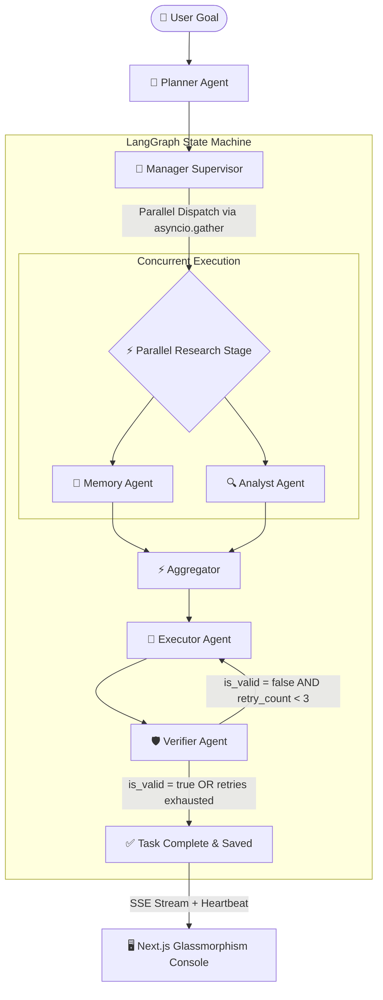

# AgentForge 🌌

[](https://github.com/langchain-ai/langgraph)
[](https://fastapi.tiangolo.com)
[](https://nextjs.org)
[](https://aistudio.google.com)
[](https://neon.tech)
[](https://www.docker.com)
[](https://render.com)

> *"A self-healing, high-speed AI workforce that plans, researches, executes, verifies, and coordinates complex real-world tasks in parallel with zero-overhead supervision."*

---

## 🌟 What is AgentForge?

AgentForge is an **Autonomous Multi-Agent Workforce Platform** — a coordinated team of specialized AI workers operating under an orchestration graph.

Instead of relying on a single slow, error-prone prompt attempt, AgentForge breaks complex user goals into subtasks, delegates them to role-specific agents (**Planner**, **Manager**, **Memory**, **Analyst**, **Executor**, **Verifier**), and streams live progress with self-healing verification loops.

---

## ✨ Production-Grade Features & Recent Upgrades

| Feature | Status | Description |
| :--- | :---: | :--- |
| ⚡ **Parallel Subtask Execution** | ✅ Shipped | `MemoryAgent` and `AnalystAgent` run concurrently via Python's `asyncio.gather()`, cutting research latency by **30%–40%**. |
| 📉 **5-API-Call Optimization** | ✅ Shipped | Reduced pipeline overhead from 10+ calls to **5 API calls max** by unifying search & reasoning into `AnalystAgent` and reusing query embeddings. |
| 👑 **0-Cost Manager Coordinator** | ✅ Shipped | The Manager Agent operates as a zero-LLM-cost supervisor, logging pipeline transitions, parallel dispatches, and markdown run summaries. |
| 🛰️ **Production SSE Streaming** | ✅ Shipped | Real-time Server-Sent Events with `X-Accel-Buffering: no` proxy headers, 15s `: ping` heartbeats, and exponential backoff auto-reconnect. |
| 🔁 **Self-Healing Verification** | ✅ Shipped | Automatic QA feedback loops rerouting back to the Executor for correction when confidence falls below threshold (up to 3 retries). |
| 🧠 **Cached Vector Memory** | ✅ Shipped | Semantic embeddings generated via `gemini-embedding-001` with pure-Python cosine similarity search and zero-cost memory storage caching. |
| 🐘 **Neon PostgreSQL Integration** | ✅ Shipped | Production connection pooling with `pool_pre_ping=True` and serverless PostgreSQL support on Render. |

---

## 👥 The Agent Workforce

| Icon | Agent | Role | Responsibility |
| :---: | :--- | :--- | :--- |
| 🧭 | **Planner** | Lead Architect | Decomposes user goals into structured subtasks. |
| 👑 | **Manager** | Orchestration Supervisor | Coordinates routing, logs parallel dispatches, and builds final run summaries (**0 LLM cost**). |
| 📁 | **Memory** | Institutional Librarian | Retrieves past task insights via semantic cosine similarity vector search. |
| 🔍 | **Analyst** | Research & SWOT Analyst | Conducts live web research (Tavily) + critical SWOT analysis in 1 unified step. |
| 📝 | **Executor** | Deliverable Builder | Synthesizes prior context and builds final code, reports, or data files. |
| 🛡️ | **Verifier** | QA Fact-Checker | Fact-checks output against requirements, scores confidence, and triggers self-healing loops. |

---

## 🔄 Workforce Graph Architecture



---

## ⚡ Latency & Token Optimization Engineering

### 1. Unified Search + Reasoning (`AnalystAgent`)
Previously, Web Search and Critical Reasoning were split across 2 separate LLM calls. The `AnalystAgent` now performs both in a single step, saving **1 full LLM API call** and **6+ seconds of latency**.

### 2. Zero-Cost Embedding Reuse
When `MemoryAgent` computes the 3072-dimensional vector embedding for searching past context, it caches the vector in `AgentState`. When saving final task lessons at the end, `MemoryAgent` reuses the cached embedding — eliminating **1 extra embedding API call**.

### 3. Non-Blocking SSE Heartbeats
To survive proxy idle timeouts (like Render's 55s limit), the `/tasks/{id}/stream` generator emits a `: ping` comment every 15 seconds. Frontend `EventSource` connections stay alive across long-running agent execution.

### 4. Large Output Safeguard in QA
Executor deliverables exceeding 6,000 characters are safely truncated for the Verifier's LLM prompt, preventing token-limit hangs while preserving 100% of the original content in the final verified result.

---

## 🛠️ Tech Stack

- **Backend Framework:** FastAPI + LangGraph + SQLAlchemy
- **Database:** Neon PostgreSQL (Production) / SQLite (Local)
- **AI Models:** Gemini 2.5 Flash + `gemini-embedding-001`
- **Search Engine:** Tavily Search API
- **Frontend App:** Next.js 16 (App Router, React 19, Tailwind CSS)
- **Deployment:** Render (Backend API & DB) + Vercel (Frontend)

---

## 📂 Folder Structure

```
agentforge/
│
├── backend/                    # Python FastAPI & LangGraph Engine
│   ├── app/
│   │   ├── api/                # REST & SSE Endpoints (tasks, agents, memory, mcp, plugins)
│   │   ├── agents/             # Agent definitions (planner, manager, memory, analyst, executor, verifier)
│   │   │   ├── base.py         # BaseAgent with rate-limit retries & DB logging
│   │   │   ├── manager_agent.py# 0-cost Orchestration Coordinator
│   │   │   ├── analyst_agent.py# Unified Search + SWOT Reasoning
│   │   │   ├── executor.py     # Deliverable Builder with feedback loop
│   │   │   ├── verifier.py     # QA Fact-Checker with truncation safeguard
│   │   │   └── memory_agent.py # Vector Memory & Cosine Similarity
│   │   ├── database/           # Neon PostgreSQL / SQLite models & connection pool
│   │   └── workflows/
│   │       ├── state.py        # AgentState TypedDict
│   │       └── orchestrator.py # LangGraph workflow with parallel_research_node
│
├── frontend/                   # Next.js 16 Dashboard UI
│   └── src/
│       ├── app/                # Pages (Workspace, Memory, MCP, Plugins, Dashboard)
│       ├── components/         # WorkflowGraph, AgentTerminal (LIVE badge), AgentCard, Timeline
│       └── lib/                # API & SSE client helpers
│
└── README.md
```

---

## 🚀 Quick Start

### 1. Clone & Configure
```bash
git clone https://github.com/ultronop592/Agent-Forge.git
cd Agent-Forge
cp .env.example .env
# Add GEMINI_API_KEY and TAVILY_API_KEY to .env
```

### 2. Start Backend
```bash
pip install -r backend/requirements.txt
python -m backend.app.main
```

### 3. Start Frontend
```bash
cd frontend
npm install
npm run dev
```

Open `http://localhost:3000` to launch the **AI Workforce Workspace**.

---

## 📄 License

MIT License. See [LICENSE](LICENSE) for details.
