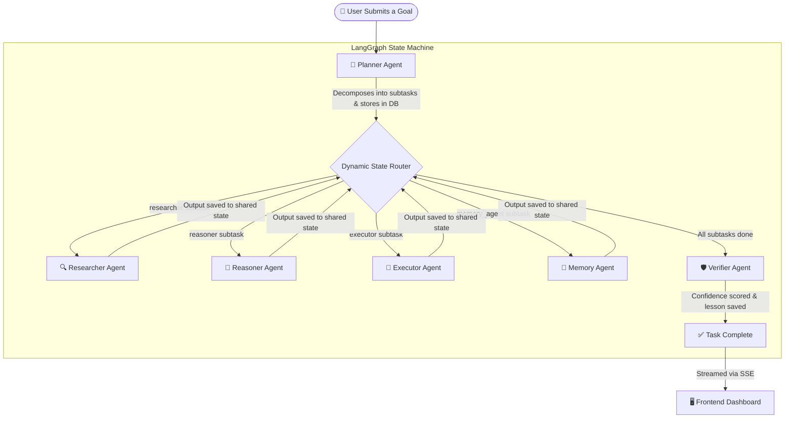

# AgentForge 🌌

[](https://github.com/langchain-ai/langgraph)
[](https://fastapi.tiangolo.com)
[](https://nextjs.org)
[](https://aistudio.google.com)
[](https://sqlite.org)
[](https://www.docker.com)

> *"A collaborative AI workforce that researches, reasons, plans, executes, verifies, and continuously improves complex real-world tasks."*

---

## 🌟 What is AgentForge?

AgentForge is a **Multi-Agent Workforce Platform** — not a chatbot, not a single-model assistant, but a coordinated team of specialized AI workers that collaborate on complex, multi-step goals.

Most AI tools today operate like a single freelancer handed an entire project. They attempt to plan, research, write, and verify all at once, leading to inconsistent quality, hallucinations, and poor performance on long-horizon tasks.

AgentForge solves this by thinking like an **organization**. The work is distributed across dedicated agents — each with a defined role, its own reasoning loop, and a handoff protocol. The result is a pipeline that is more accurate, more transparent, and more reliable than any single-model approach.

---

## 🧠 Core Concept — Multi-Agent Orchestration

The central idea is **cognitive division of labor**. Human organizations don't have one person plan, research, write, review, and archive simultaneously. Neither does AgentForge.

When a user submits a goal, the system does not just forward it to a language model. Instead, it routes the goal through a structured sequence of agents, each of which:

- Receives a focused, scoped subtask (not the full open-ended goal)
- Operates with its own domain-specific reasoning instructions
- Passes its output to the next agent as structured context
- Has its work independently verified at the end

This architecture is called a **directed agent graph** — a flowchart of AI workers where data moves forward through the pipeline, each node building on the work of the previous one.

---

## 👥 The Six Agent Roles

| Icon | Agent | Role | What It Does |
| :---: | :--- | :--- | :--- |
| 🧭 | **Planner** | Project Manager | Reads the user's goal and decomposes it into 2–3 ordered subtasks. Decides which agent handles which step. |
| 🔍 | **Researcher** | Intelligence Analyst | Searches the web via Tavily, aggregates sources, and produces a structured research document. |
| 🧠 | **Reasoner** | Critical Thinker | Receives research output, cross-checks facts, identifies logical gaps, runs SWOT-style analysis, and draws conclusions. |
| 📝 | **Executor** | Technical Writer / Developer | Takes research and reasoning as context and produces the final deliverable — a report, code, guide, or analysis. |
| 🛡️ | **Verifier** | QA Inspector | Fact-checks the Executor's output against the original goal, scores confidence (0.0–1.0), and flags hallucinations. |
| 📁 | **Memory** | Institutional Librarian | Queries past task results for relevant context before new tasks begin. Saves key learnings after each task completes. |

---

## 🔄 How the Agents Collaborate — The Full Flow



### Step-by-Step Walkthrough

**Step 1 — Planning**
The user submits a goal. The Planner Agent reads the full goal and uses the language model to intelligently decompose it into 2–3 sequential subtasks. Each subtask is assigned to the appropriate specialist agent and stored in the database.

**Step 2 — Dynamic Routing**
The LangGraph orchestrator reads the ordered subtask list. A conditional routing function inspects each subtask's `assigned_agent` field and dispatches it to the correct node in the graph — no hard-coded sequence, fully data-driven.

**Step 3 — Sequential Agent Execution**
Each agent runs one subtask at a time. It receives the full context from all previous agents, performs its specialized reasoning, and appends its output to the shared `AgentState` dictionary before returning control to the router. Real-time thinking logs are written to the database and streamed live to the frontend.

**Step 4 — Verification**
Once all subtasks are complete, the Verifier Agent runs automatically. It evaluates the Executor's final output against the original goal, assigns a confidence score, and polishes the document. The result is persisted to the database.

**Step 5 — Memory Storage**
Immediately after verification, the Memory Agent saves the key lesson from the task to long-term storage. Future tasks on similar topics will retrieve this context in Step 1, making the system progressively smarter over time.

---

## 🛠️ Architecture & Technology

AgentForge is composed of three layers — a stateful backend workflow engine, a REST API communication layer, and a real-time frontend dashboard.

---

### Layer 1 — Workflow Engine (LangGraph + Python)

The brain of the system. LangGraph compiles a **StateGraph** — a directed flowchart of agent nodes and conditional routing edges. A shared `AgentState` dictionary acts as the project file, passed from node to node and enriched at each step.

Every agent node follows the same contract:
- It reads from the shared state
- It calls the Gemini 2.5 Flash language model with a focused, scoped prompt
- It writes its output back to the shared state
- It updates the task and subtask status in the database

The graph is compiled once at application startup and reused for every task, making execution stateless and concurrent-safe.

---

### Layer 2 — API Server (FastAPI + Async Python)

FastAPI serves as the coordination layer between the frontend and the workflow engine. When a user submits a task, FastAPI:

1. Creates a `Task` record in the database
2. Launches the LangGraph workflow as a **background task** (non-blocking)
3. Returns the task ID to the frontend immediately

The frontend then opens a **Server-Sent Events (SSE)** stream on that task ID. The SSE endpoint polls the database every 500ms and pushes any new agent logs, subtask status changes, or final results to the frontend in real time — without any polling from the client side.

---

### Layer 3 — Frontend Dashboard (Next.js + TypeScript)

The visual command center of the application. Built with Next.js App Router and rendered as a dark glassmorphism interface. The dashboard features:

- **Workflow Graph** — A live SVG node graph showing which agent is active and how data flows between them
- **Agent Terminal** — A monospace console streaming raw thinking logs from each agent in real time
- **Execution Timeline** — A step-by-step checklist of subtask statuses (pending → running → completed)
- **Verified Output Viewer** — A clean Markdown document renderer showing the final polished result with confidence scoring

---

### Supporting Systems

**SQLite / PostgreSQL Database**
Stores all tasks, subtasks, agent logs, memory entries, and MCP server configurations. On Render (production), a Neon PostgreSQL instance is used. Locally, SQLite is the default for zero-configuration setup.

**Model Context Protocol (MCP) Manager**
An extensible plugin bus for external tools. The MCP manager can connect to any stdio-compatible server (Node.js, Python, or any CLI tool), discover its available tools via JSON-RPC, and make those tools callable by any agent. This allows the system to be extended with filesystem access, browser control, database queries, or any custom tooling without modifying the agent code itself.

**Tavily Search API**
Used exclusively by the Researcher Agent. Tavily is a search API purpose-built for AI agents — it returns structured, summarized results (not raw HTML) optimized for language model consumption. The Researcher uses it to gather real-world information before the reasoning and execution stages.

**Gemini 2.5 Flash**
The language model powering all six agents. Chosen for its large context window (critical for processing multi-agent accumulated state), fast inference speed, and structured JSON output mode (used by the Planner and Verifier for reliable schema-validated responses).

---

## 📂 Folder Structure

```
agentforge/
│
├── backend/                    # Python backend — FastAPI, LangGraph, Agents
│   └── app/
│       ├── api/                # REST endpoints (tasks, agents, memory, plugins, mcp)
│       ├── agents/             # Six agent definitions (planner, researcher, reasoner, executor, verifier, memory)
│       ├── core/               # Environment config loader
│       ├── database/           # SQLAlchemy models and session management
│       ├── mcp/                # MCP JSON-RPC client and manager
│       ├── plugins/            # Workflow plugin registry and built-in plugins
│       ├── workflows/          # LangGraph state schema and orchestrator graph
│       └── main.py             # FastAPI application entrypoint
│
├── frontend/                   # Next.js frontend — Dashboard UI
│   └── src/
│       ├── app/                # App Router pages (chat, memory, plugins, mcp, recent)
│       ├── components/         # UI components (WorkflowGraph, AgentTerminal, Timeline, etc.)
│       └── lib/                # API client helpers
│
├── docker-compose.yml          # Local container orchestration
├── render.yaml                 # Render PaaS deployment configuration
└── .env.example                # Environment variable template
```

---

## 🔌 Plugin System

AgentForge's workflow sequences are not hard-coded. Each workflow is packaged as a **Plugin** — a self-contained configuration class that defines:

- The **name and ID** of the workflow (displayed in the UI dropdown)
- A **description** of what it does
- Custom **system instructions** for each agent (overriding their default personas)
- A **default subtask sequence** if the Planner should bypass LLM decomposition

Two plugins ship out of the box:

| Plugin | Purpose | Agent Sequence |
| :--- | :--- | :--- |
| **Startup Market Research** | Market sizing, SWOT analysis, competitor profiling | Memory → Researcher → Reasoner → Executor → Verifier |
| **Software Debugging Suite** | Root cause diagnosis and code fix generation | Researcher → Reasoner → Executor → Verifier |

New plugins can be added by creating a single class file and registering it in the plugin registry. The frontend immediately reflects the new workflow option with no UI changes required.

---

## 🔮 Future Roadmap

**Semantic Vector Memory**
Replace the current keyword-based SQLite memory with a vector database (ChromaDB, PgVector, or Pinecone) to enable embedding-based similarity search. This allows the Memory Agent to retrieve contextually relevant past insights rather than exact keyword matches.

**Graph Loopback on Verification Failure**
Extend the LangGraph edges so that if the Verifier assigns a confidence score below a threshold, the task is automatically routed back to the Executor with the Verifier's feedback as a correction prompt — a self-healing pipeline.

**Containerized MCP Sandboxing**
Run all external MCP tool servers inside isolated Docker containers, preventing third-party scripts from accessing the host filesystem or network during production execution.

**Full-Duplex WebSocket Streaming**
Upgrade the current one-way Server-Sent Events stream to bidirectional WebSockets, enabling users to inject instructions or corrections into an active pipeline mid-execution.

**Multi-User Authentication**
Add OAuth 2.0 authentication and per-user task isolation to support concurrent multi-tenant usage on a shared deployment.
